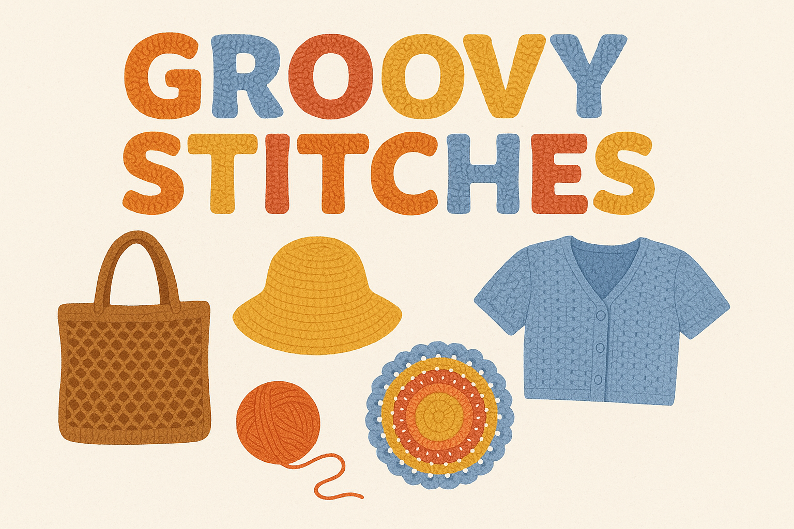

# 🧵 GroovyStitches

 <!-- Replace with your project banner if you have one -->

## 📌 Project Overview  
**✨ GroovyStitches** is a handmade e-commerce website designed for a local brand that sells handcrafted bags, clothes, and crochet products.  

The website provides an elegant and user-friendly interface where customers can:  
- 👜 **Browse** different product categories (bags, clothes, and accessories).  
- 📄 **View** detailed product pages with descriptions, images, and prices.  
- 🛒 **Add** items to their shopping cart and manage their orders.  
- 📩 **Contact** the seller easily through an integrated contact form or social media links.  

✨ The main goal of GroovyStitches is to showcase the beauty of handmade products and provide a smooth online shopping experience while reflecting the **artistic and creative identity** of the brand.  

---

## 👥 Team Members  
🔹 Youssef Medhat Kamal Mohamed  
🔹 Basem Ahmed Hassan Ali  
🔹 Menna Khaled Abd El Rheem El Sayed  
🔹 Eman Anwar Ahmed Altohamy  
🔹 Sama Ahmed Ibrahim Radwan 

---

## 🔑 Key Features  
- 🛍️ **Product Browsing** – Explore handcrafted bags, clothes, and crochet accessories.  
- 📖 **Detailed Product Pages** – Descriptions, images, and prices for every product.  
- 🛒 **Shopping Cart & Order Management** – Seamlessly add and manage items.  
- 📬 **Easy Communication** – Integrated contact form & direct social media links.  
- 🎨 **Elegant UI/UX** – A smooth, minimal, and artistic interface designed to highlight craftsmanship.  

---

## 🎯 Project Goals  
✔ Build a user-friendly online store for handcrafted goods.  
✔ Provide a seamless browsing and shopping experience.  
✔ Connect customers directly with the seller.  
✔ Reflect the **artistic identity** of the brand.  
✔ Support small businesses by promoting handmade fashion.  

---

## 💡 Why GroovyStitches?  
Because handmade fashion deserves a digital stage! GroovyStitches bridges craftsmanship and technology, giving customers easy access to unique, artistic, and creative pieces while supporting a local brand.  

---

## 🏷️ Tagline  
**GroovyStitches – ✨ Every Stitch Tells a Story. ✨**  
